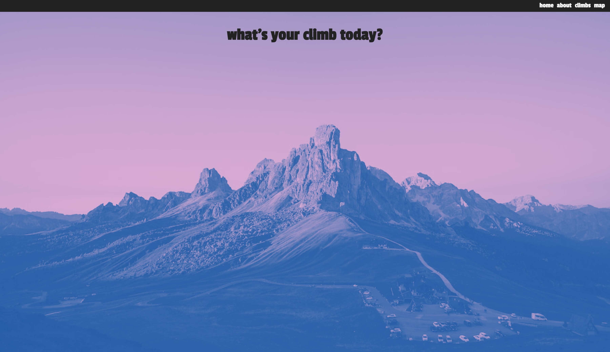

# climb on!

Where you can find rock climbing routes, in the wild!

## Description

A list of places where you can find climbing routes and a Google map for you to check how far is your upcoming route is from you.

### Technical Used

- React
- Apollo Client for API

### Wireframes

A rough idea of the website:

End product:

Home Page:

About Page:
src/assets/aboutpage.jpg

Climb Page:
src/assets/climbpage.jpg

Map Page
src/assets/mappage.jpg

### User Stories

User will be able to view the the list of climbs under climbs section.

A Google Map is found under Map, with current location of the user narrowed down, when clicked on the location icon.

The Map will auto generate places when keyed in prompts.

---

## Planning and Development Process

Started the project with the idea of having a resource where a user can view the climbs.

### Problem-Solving Strategy

Google the heck out of everything.

### Unsolved problems

- To have a better filter for different climbs by areas, climbing grade etc
- To generate a link between the climb's latitude & longtitude with the map's input destination

## APIs Used

Openbeta: https://api.openbeta.io/
Google Maps API

---

## Acknowledgments

---

## References
