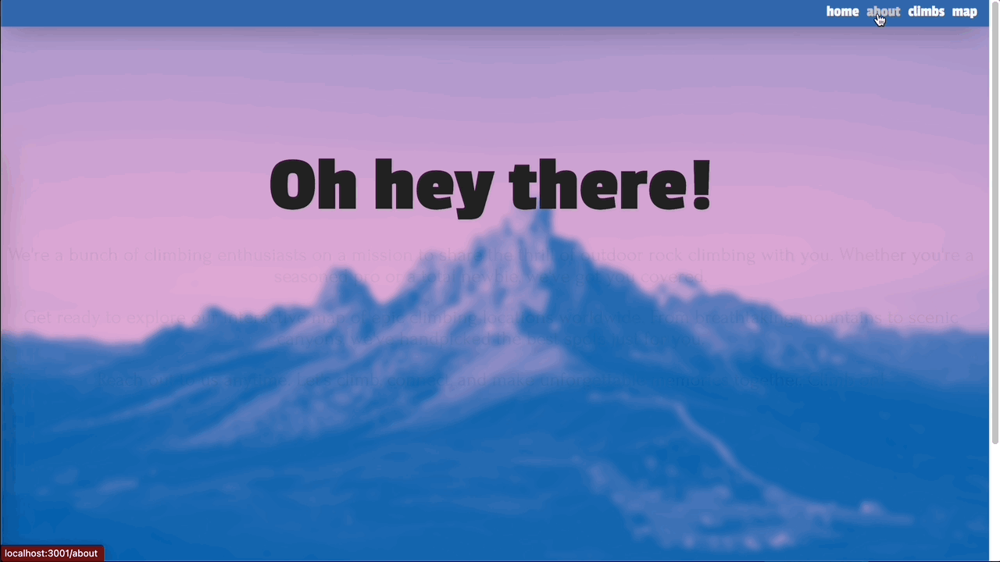

# Climb on!

Where you can find rock climbing routes, in the wild!

## Description

A list of places where you can find climbing routes and a Google map for you to check how far is your upcoming route is from you.

### Technical Used

- React
- Apollo Client for API

### Wireframes

A rough idea of the website:

End product:

Home Page:

About Page:

Climb Page:

Map Page

### User Stories

Home Page:
User will be on the landing page where they can scroll through the website.

About Page:
User can find more information about us!

Climb Page:
User can find available climbs(projects) to climb. User is able to copy and paste the coordinates from the climbs into the map, and it will show the route, distance and duration from origin to destination.

Map Page:
User can use the map to narrow down their location by pressing the location arrow, key in the origin or destination and the map will auto suggest places when keyed in prompts.

---

## Planning and Development Process

Started the project with the idea of having a resource where a user can view climbs, with map attached.

### Problem-Solving Strategy

Google the heck out of everything.

### Unsolved problems

- To have a better filter for different climbs by areas, climbing grade etc
- To generate a link between the climb's latitude & longtitude with the map's input destination

## APIs Used

Example of API:

- Openbeta: https://api.openbeta.io/
- Openbeta Git: https://github.com/OpenBeta/openbeta-graphql
- Google Maps API

---

## References

Playground: https://lucasconstantino.github.io/graphiql-online/
